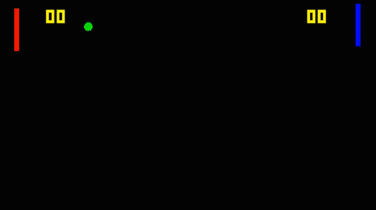

# Space Pong
Pong game featuring tough CPU opponents.



### CPU opponents

Easy mode just moves towards the puck's vertical position and is easy to beat... hard mode integrates the puck velocity and moves towards its intersection with the paddle axis.

Serve strategy is to move a random distance up or down from the intersection (to give a random return trajectory).

After a serve, it can either stay still, move back to the centre, or mirror the other player.

[Click here for video](img/pong.mp4)


```
Left paddle:
  Up/Down: Q/A
  CPU On/Off : W/S

Right paddle:
  Up/Down: Up arrow/Down arrow
  CPU On/Off : O/L

Difficulty:
  Easy: V
  Hard-Stay : B
  Hard-Reset: N
  Hard-Follow: M

Game speed Up/Down : T/G
Reset game: R
Debug On/Off : E/D
```

## Build
#### Linux

Install CMake, e.g. for Debian/Ubuntu:
```
sudo apt-get install build-essential libssl-dev
sudo apt-get install cmake
```
Install SFML:
```
sudo apt-get install libsfml-dev
```

Clone repo and make a new directory called ```build``` inside the ```src```
directory and enter it.
```
cd {DOWNLOAD_LOCATION}/space-pong/src
mkdir build
cd build
```
run CMake
```
cmake ../
```

run make
```
make
```
Start the game:
```
./Pong
```
#### Windows
Install [CMake](https://cmake.org/), use CMake GUI or command line to generate
Visual Studio .sln file, then build with VS.