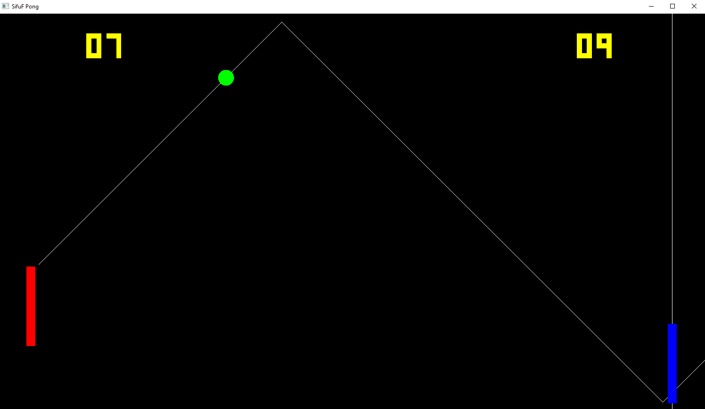
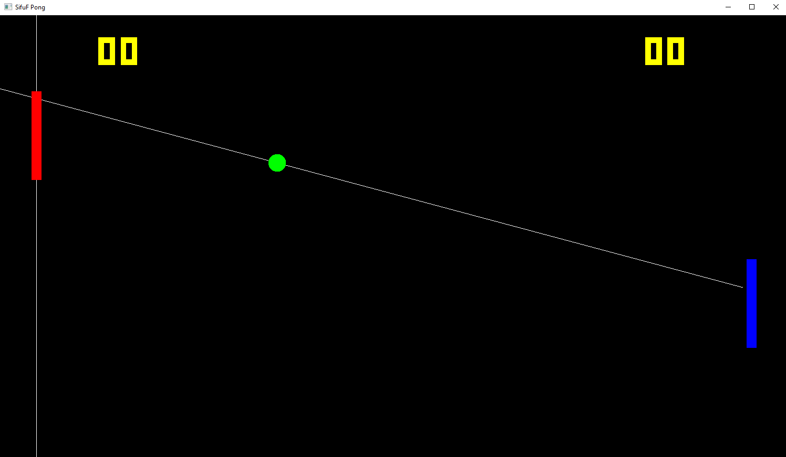

# space-pong
Pong game featuring tough CPU opponents



Easy mode just moves towards the puck's vertical position and is easy to beat... hard mode integrates the puck velocity and moves towards its intersection with the paddle axis.

Serve strategy is to move a random distance up or down from the intersection (to give a random return trajectory).

And strats for after its serve, it can either stay still, move back to the centre, or mirror the other player.



```
Left paddle:
  Up/Down: Q/A
  CPU On/Off : W/S

Right paddle:
  Up/Down: Up arrow/Down arrow
  CPU On/Off : O/L

Game speed Up/Down : T/G
Reset game: R
Debug On/Off : E/D
```
